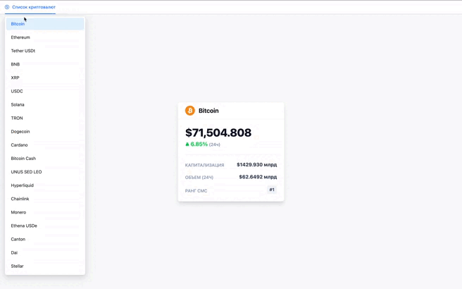

# Cryptocurrency Tracker



**Cryptocurrency Tracker** — это современное, высокопроизводительное SPA-приложение для мониторинга рынка криптовалют. Проект предоставляет пользователю актуальные данные по топ-100 монет в реальном времени, демонстрируя чистое разделение фронтенд- и бэкенд-частей, а также решение нетривиальных задач, таких как оптимизация запросов к API (кеширование) и кросс-доменное взаимодействие (CORS).

---

## Содержание

- [Ключевые особенности](#ключевые-особенности)
- [Технологический стек](#технологический-стек)
- [Архитектура и решения](#архитектура-и-решения)
- [Начало работы](#начало-работы)
    - [Системные требования](#системные-требования)
    - [Установка и запуск](#установка-и-запуск)
- [Разработка](#разработка)
- [Вклад в проект](#вклад-в-проект)
- [Команда проекта](#команда-проекта)

---

## Ключевые особенности

- Топ-100 криптовалют: Отображение таблицы с сотней самых популярных монет.
- Детальная информация: По каждой монете доступны: логотип, название, цена в USD, рыночная капитализация, объем торгов за 24 часа, рейтинг (rank) и процент изменения цены за последние 24 часа.
- Оптимизация производительности:
- Кеширование на бэкенде: Благодаря async_lru, повторные запросы за данными обрабатываются мгновенно, снижая нагрузку на внешнее API.
- Асинхронность: Полностью асинхронный бэкенд на FastAPI и фронтенд с React обеспечивают высокую отзывчивость интерфейса.
- Чистая архитектура: Бэкенд и фронтенд существуют как два независимых сервиса, общающихся по HTTP.

---

## Технологический стек

### Frontend

- Ядро: React
- Сборка: Vite
- Язык: JavaScript
- Стилизация: TailwindCSS + Ant Design
- HTTP-клиент: Axios
- Хуки: useState, useEffect для управления состоянием и жизненным циклом компонентов.

### Backend

- Ядро: Python
- Фреймворк: FastAPI
- Кеширование: async_lru
- Асинхронность: Все эндпоинты реализованы с использованием async/await.
- CORS: Настроена политика CORS для безопасного взаимодействия с фронтендом.

---

## Архитектура и решения

1. **Разделение ответственности:** Проект разделен на два независимых микросервиса. Бэкенд выступает прокси-сервером: он получает запрос от фронтенда, идет с ним к внешнему источнику данных (API биржи), обрабатывает ответ и отправляет его клиенту.
2. **Решение проблемы CORS:** Браузеры блокируют запросы к API, которые не поддерживают CORS. В этом проекте бэкенд выступает посредником. Фронтенд стучится на свой сервер (localhost:8000), который уже имеет право делать запросы куда угодно. В FastAPI мы явно разрешили запросы с адреса фронтенда (localhost:5173), добавив соответствующие заголовки.
3. **Оптимизация с помощью кеша:**
    - Проблема: Внешнее API криптовалют часто имеет лимиты на количество запросов. Если 100 пользователей откроют приложение одновременно, бэкенд сделает 100 одинаковых запросов к внешнему API, что может привести к блокировке.
    - Решение: Мы внедрили async_lru. Когда приходит первый запрос, бэкенд идет во внешний мир, получает данные и сохраняет их в памяти. Все последующие запросы в течение заданного времени (пока кеш актуален) будут мгновенно получать данные из памяти, не нагружая внешнее API.

---

## Начало работы

### Системные требования

- Node.js версии 18+
- Python версии 3.11+
- Git

### Установка и запуск

Проект состоит из двух частей. Запускать их нужно одновременно (в разных терминалах).

1. **Клонирование репозитория** <br><br>

    ```
    git clone https://github.com/Georgy-dev/Cryptocurrency-Tracker
    ```

    ```
    cd crypto-tracker
    ```

2. **Настройка и запуск бэкенда** <br><br>

    Переходим в папку с бэкендом

    ```
    cd backend
    ```

    Создаем виртуальное окружение (рекомендуется)

    ```
    python -m venv venv
    ```

    ```
    source venv/bin/activate # Для Linux/Mac
    ```

    ```
    venv\Scripts\activate # Для Windows
    ```

    Устанавливаем зависимости

    ```
    pip install fastapi pydantic-settings aiohttp async-lru uvicorn
    ```

    Запускаем сервер

    ```
    uvicorn src.main:app --reload
    ```

    Бэкенд будет доступен по адресу http://localhost:8000.
    Документация API (Swagger) автоматически доступна по адресу http://localhost:8000/docs.<br><br>

3. **Настройка и запуск фронтенда** <br><br>

    Откройте новый терминал.

    Возвращаемся в корневую папку и переходим в frontend

    ```
    cd ../frontend
    ```

    Устанавливаем зависимости

    ```
    npm install
    ```

    Запускаем dev-сервер Vite

    ```
    npm run dev
    ```

    Фронтенд будет доступен по адресу http://localhost:5173. Откройте этот адрес в браузере.

---

## Разработка

### Бэкенд

Логика работы с API вынесена в отдельный клиент в файле `http_client.py`, а эндпоинты настроены в `router.py`. Основной роутер с префиксом /cryptocurrencies подключается в `main.py`.

В коде реализовано следующее:

- Используется декоратор `@alru_cache` (из библиотеки `async_lru`) для кеширования ответов от API.
- Выполняются асинхронные запросы к CoinMarketCap через `aiohttp.ClientSession`.
- Реализовано два эндпоинта: получение полного списка криптовалют и детальной информации по конкретному ID.

### Фронтенд

Основной компонент — `App.jsx`. Он:

- Использует useState для хранения списка монет и состояния загрузки.
- Использует useEffect для выполнения GET-запроса к бэкенду через axios при монтировании компонента.
- Отрисовывает таблицу с данными, стилизованную через TailwindCSS.

---

## Вклад в проект

Если у Вас есть предложения или Вы нашли баг, пожалуйста, создавайте Issue в репозитории. Pull Request'ы приветствуются. Пожалуйста, убедитесь, что Ваш код следует общей структуре проекта.

---

## Команда проекта

Проект выполнен в рамках портфолио для стажировки мечты.

- Фронтенд-разработчик: Георгий Агеев
- Бэкенд-разработчик: Георгий Агеев

GitHub: https://github.com/Georgy-dev.

Telegram: [@GeorgeFrontDev](https://t.me/GeorgeFrontDev).
